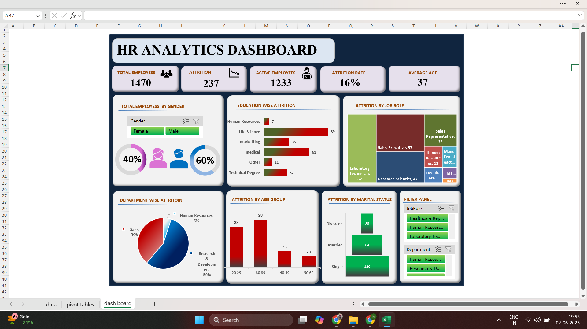

# Employee Attrition Dashboard (Excel Project)

Welcome to my Excel-based data analysis project focused on **Employee Attrition**. This project uses a real-world HR dataset, cleaned and transformed into an **interactive dashboard** that helps HR teams and decision-makers understand key attrition trends.

---

## Tools Used

- Microsoft Excel
- Pivot Tables & Pivot Charts
- Slicers & Filters
- Treemap, Funnel, and Bar Charts
- Data Cleaning (handling missing values, outliers, formatting)

---

## Dataset Source

This project uses a modified version of the public IBM HR Analytics dataset:

-  **Dataset Name**: IBM HR Analytics Employee Attrition & Performance
-  **Source**: [Kaggle Dataset Link](https://www.kaggle.com/datasets/pavansubhasht/ibm-hr-analytics-attrition-dataset)
-  I manually introduced **messy data** (e.g., missing values, outliers like age = 150) to simulate real-world challenges for data cleaning practice.

---

##  Project Objectives

- Clean a messy HR dataset to make it analysis-ready
- Create age bands, handle nulls, and standardize fields
- Build an interactive Excel dashboard for business use
- Find key factors driving employee attrition

---

## Key Insights

- **Attrition Rate**: ~16.5%
-  Highest attrition seen in the **Research and development department**
-  ** employees (30–40 years)** are more likely to leave
-  **Single employees** show higher attrition rates
-  Roles like **Sales Executive** and **Lab Technicians** had most turnover

---

##  Dashboard Features

- Interactive filters by:
  - Department
  - Gender
  - Job Role
- Visualization Types:
  - Funnel Chart (Attrition by marrital status)
  - Treemap (Attrition by Job Role)
  - Bar Chart (Education-wise Attrition)
- Summary cards with key KPIs like attrition % and headcount

---

##  Data Cleaning Highlights

- Replaced incorrect/missing `Age` values with **median**
- Filled missing values in `Attrition` using logic-based imputation
- Removed unrealistic entries (like age = 150, 200)
- Created derived fields like `Age Band` for better grouping

---

##  Dashboard Preview

*(Include a screenshot here, if possible)*  

---

## 📁 Files Included

- `Employee_Attrition_Dashboard.xlsx` – Cleaned and analyzed dataset with pivot tables and dashboard
- `README.md` – Project documentation (this file)

---

## 👨‍💼 About Me

I'm an aspiring **Data Analyst** passionate about turning raw data into meaningful insights. This project showcases my ability to:
- Clean and prepare real-world data
- Analyze key HR metrics
- Build dashboards for decision-makers

---

